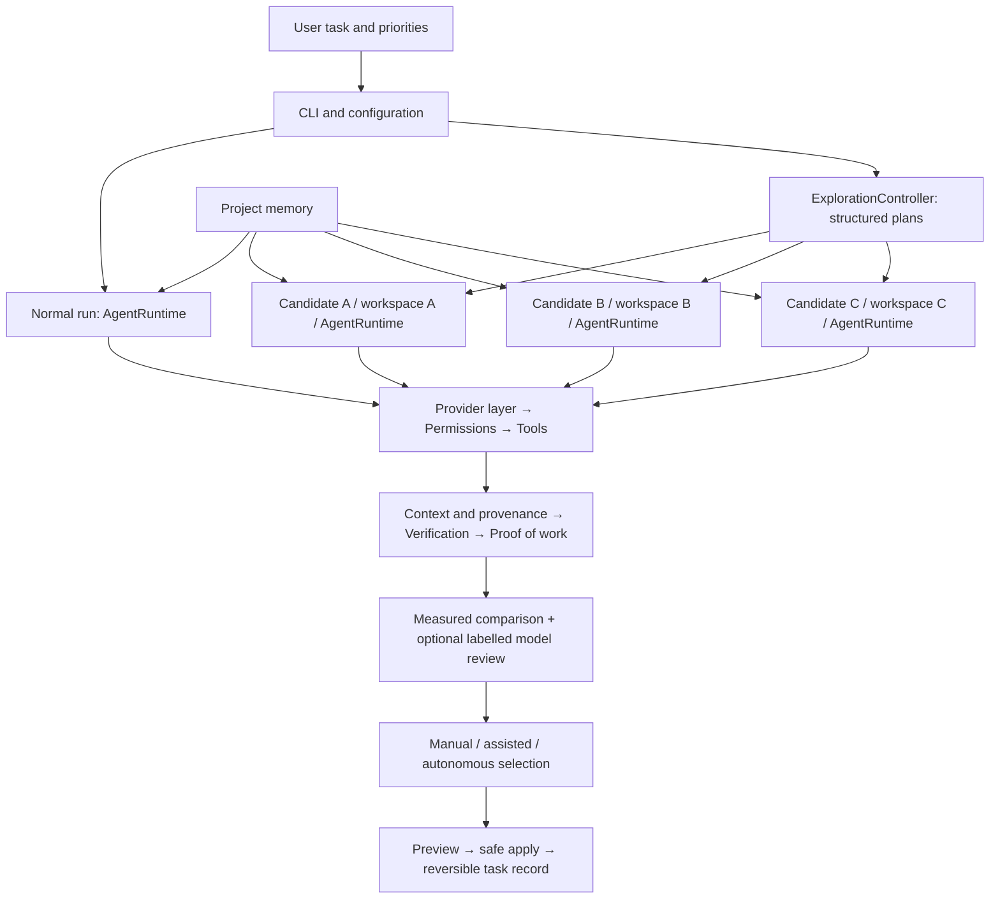

# Forge

Most coding agents commit to the model's first solution. **Forge explores alternative real implementations, verifies each in isolation, and selects using evidence and your priorities.**

Forge is an open-source, model-agnostic Python runtime. Normal tasks and every exploration candidate share one agent runtime, tool registry, permission engine, context engine, verification system and proof of work.



## Quickstart

Requires **Python 3.12+**; Git is required for Git worktrees.

```sh
git clone https://github.com/jayspyroyale/forge-agent.git
cd forge-agent
python -m venv .venv
# Windows: .venv\Scripts\activate
# macOS/Linux: source .venv/bin/activate
python -m pip install -e ".[dev]"
forge doctor
```

Set `OPENAI_API_KEY` for OpenAI, or run a local Ollama model:

```sh
forge run -p openai "Fix the tests"
forge run -p ollama -m llama3 "Fix the tests"
python -m forge.benchmarks.demo          # offline scripted models, real tools and verification
```

The [offline demo](examples/exploration/README.md) prints three candidate plans, isolated edits, verification, estimated costs, comparison, selection, application and undo. The [broken calculator](examples/broken_calculator/README.md) also supports a normal run.

## Explore, compare and apply

```sh
forge explore --approaches 3 "Implement caching" --no-apply
forge explorations show latest
forge explorations show latest --candidate A --patch
forge explorations compare latest
forge explorations select latest A
forge explorations apply latest
forge tasks list
forge tasks undo TASK_ID
```

The default assisted mode recommends an eligible candidate, asks you to choose, then asks before applying. `--mode manual` lets you choose. `--mode autonomous --apply` explicitly enables policy selection and application. Autonomous selection alone leaves your project unchanged. `--yes` approves tool actions classified “ask”; it never overrides a denial.

Candidates use detached Git worktrees or separate copies for non-Git projects. Uncommitted changes are copied into the baseline; `--from-head` leaves them out. Merge/rebase operations, unresolved conflicts and repositories without commits are refused. Workspaces normally clean up after execution; `--keep` retains them. Every candidate's local evidence and patch remain available.

Apply validates all touched-file baseline hashes and saved candidate content before writing. Later edits produce conflicts; unrelated files stay untouched. Originals are journaled, creating an inspectable, undoable task.

## Configuration and policy

Precedence: defaults → profile → user TOML → project TOML → `FORGE_*` environment → CLI.

User config: `~/.forge/config.toml` (or `$FORGE_HOME/config.toml`). Project config: `.forge/config.toml`. Use `forge config show` and `forge config paths`. Profiles include cheap, balanced, production, maximum-quality and custom profiles.

```toml
[model]
provider = "openai"
max_response_tokens = 4096
# Supply actual prices to enable dollar-budget admission:
# input_cost_per_million = 1.0
# output_cost_per_million = 2.0

[permissions]
read = "allow"
write = "ask"
execute = "ask"
dangerous = "deny"

[exploration]
approaches = 5
adaptive = true
selection_mode = "assisted"             # manual | assisted | autonomous
review = "auto"                         # auto | always | never
max_tokens = 100000
max_elapsed_time = 300
# max_api_cost = 0.50                   # requires configured prices

[exploration.weights]
correctness = 50
safety = 20
cost = 10
speed = 10
simplicity = 10
minimal_diff = 5
maintainability = 0                     # optional model assessment
scalability = 0                         # optional model assessment

[exploration.constraints]
tests_must_pass = true
no_new_dependencies = true
max_files_changed = 10
# max_cost_usd = 0.50                   # unknown cost makes a candidate ineligible
# security_checks_must_pass = true
```

Weights are finite, nonnegative and normalized. Hard constraints determine eligibility separately from scoring. A user can explicitly choose an ineligible candidate; the override is recorded. Autonomous selection never does.

**MEASURED:** checks, file/line counts, dependencies, tokens, estimated cost, elapsed time, tool calls, retries and risk events, collected from Forge's actual records.

**MODEL-ASSESSMENT:** optional opinions on maintainability, readability, architectural fit and scalability. Stored and labelled separately, affecting only configured model-assessed factors. Model claims about passing tests never become verification evidence.

## Adaptive and multi-model exploration

```sh
forge explore --approaches 5 --adaptive --max-tokens 100000 --max-time 300 "Implement caching"
```

Adaptive runs start small and stop at the candidate limit, budget exhaustion, a strong verified candidate, an improvement plateau or cancellation. Planning, implementation and review share a call ledger. Conservative UTF-8 input reservations plus output caps are replaced by reported usage; missing usage retains an estimate. Costs remain unknown without reported prices or configured rates. Admission budgets cannot guarantee vendor tokenizers, hidden retries, billing or cancellation semantics.

```toml
[exploration]
strategy = "different_approaches"        # or same_approach
model_assignment = "round_robin"        # automatic uses deterministic pool rotation
experimental_generation = true

[[exploration.model_pool]]
provider = "openai"
name = "model-a"

[[exploration.model_pool]]
provider = "ollama"
name = "model-b"

[exploration.candidate_models.C]         # explicit choice overrides the pool
provider = "openai"
name = "model-c"
```

Later generations propose fresh plans informed by eligible parents' evidence. Parent IDs and generations are recorded; code is never blindly merged.

## Models, tools and safety

Built-in providers: OpenAI Chat Completions, Ollama through its compatible API, and an offline fake provider. Other compatible endpoints use `model.base_url` or normal run/ask's `--base-url`. Native Anthropic/Gemini adapters and streaming are not implemented.

```sh
forge models list
forge ask -p fake "hello"
forge tools list
forge tools describe edit_file
forge tools run read_file path=README.md max_lines=20
```

Filesystem tools resolve paths/symlinks through Workspace and protect Git internals and records. Every model-requested tool, including MCP tools, uses ToolExecutor and PermissionEngine. Verification uses the same permissions. Default reads are allowed, writes/execution ask, dangerous actions are denied.

**Shell commands and MCP processes are not OS-sandboxed.** Classification is heuristic. Approved code runs with your account's privileges and can reach beyond a workspace. Worktrees separate working files, not hostile programs. Use a container/VM for untrusted code. Read [SECURITY.md](SECURITY.md).

## Context, memory, MCP and proof of work

Context items carry source references, order, importance, size and provenance. Deterministic budgeting compresses noisy old output and supersedes redundant observations while preserving instructions/current state. Filename/text retrieval finds relevant files without embeddings.

SQLite memory stores project-scoped instructions, architecture, decisions, facts, workflows and preferences with confidence, expiration, verification and conflict handling. Only relevant active memories enter context. Model memory writes are disabled by default.

```sh
forge memory list
forge memory inspect ID
forge memory add instruction "Run unit tests after edits"
forge memory forget ID
```

MCP supports stdio handshake, paginated discovery, namespaced tools, timeouts and disconnect handling. Configured risk determines permissions; a server cannot lower its own risk.

```toml
[mcp.servers.example]
command = "your-mcp-server"
risk = "execute"
env = { SERVICE_TOKEN = "${SERVICE_TOKEN}" }
```

```sh
forge mcp list
forge mcp tools
forge mcp test example
```

Configured servers are trusted executable programs; startup executes their command. Keep secrets in environment references, never committed config.

Proof of work records tool outcomes, commands, changes and Forge-run checks as VERIFIED / FAILED / UNVERIFIED. Local records live under `.forge/tasks/` and `.forge/explorations/`. Originals retained for undo can contain private project content: protect records and inspect before sharing.

## Benchmarks and contributing

```sh
forge benchmark list
forge benchmark run fix_python_bug --approaches 3 --yes --output experiment.json
forge benchmark run performance_improvement --normal --yes
forge benchmark compare experiment.json another.json
python -m pytest
python -m compileall -q forge tests
python -m ruff check forge tests
python -m build
```

Five tasks cover Python/TypeScript bugs, feature addition, refactoring and an operation-count performance improvement. JSON exports record reproducibility metadata; model APIs remain nondeterministic. See [benchmarks](benchmarks/README.md).

Read the [backend walkthrough](docs/ARCHITECTURE.md), [contribution guide](CONTRIBUTING.md) and [changelog](CHANGELOG.md). CI runs offline tests on Windows/Linux, compile/lint/coverage checks, wheel installation and the offline demo.

Released under the [MIT License](LICENSE).
